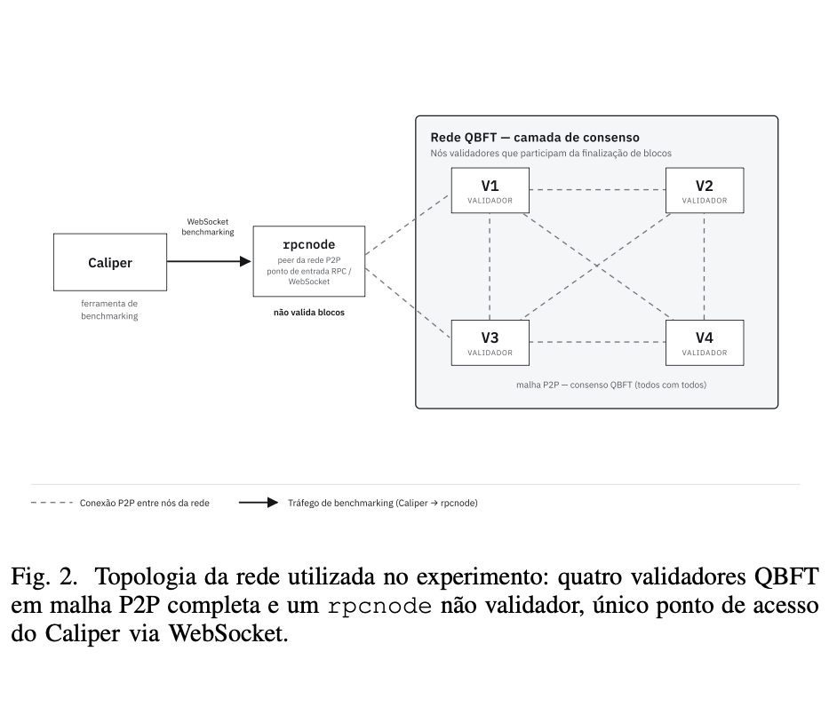

# QBFT Network Docker

Rede blockchain permissionada local usando Hyperledger Besu, consenso QBFT e Docker Compose.

## Objetivo


Este repositório faz parte de uma prova de conceito desenvolvida para fins acadêmicos.

O objetivo é demonstrar a criação, execução e avaliação experimental de uma rede blockchain permissionada local, utilizando o mecanismo de consenso QBFT do Hyperledger Besu. A estrutura foi pensada para testes controlados, experimentação em ambiente local e apoio à avaliação de desempenho com Hyperledger Caliper.

Este projeto não representa uma rede de produção. Chaves privadas, dados gerados pelos nós e arquivos de ambiente devem permanecer fora do Git.

## Contexto da Pesquisa

Este repositório apoia a pesquisa sobre auditabilidade pseudonimizada em blockchain para eventos acadêmicos, no contexto do QRCheck.

Os experimentos reportados na pesquisa foram conduzidos em uma topologia containerizada com Docker. Antes dessa versão, houve uma etapa exploratória inicial com instalação local, sem contêineres, usada apenas para validar o funcionamento do consenso. A versão mantida neste repositório corresponde à topologia dockerizada utilizada para execução controlada da rede e avaliação de desempenho.

A rede é composta por quatro nós validadores Besu executando consenso QBFT e por um `rpcnode`, que atua como ponto de entrada RPC HTTP e WebSocket para ferramentas externas. O `rpcnode` participa da rede P2P, mas não valida blocos. Os validadores compõem a malha P2P responsável pelo consenso.

Nos experimentos, o tráfego de benchmarking foi gerado pelo Hyperledger Caliper e direcionado ao `rpcnode`. Os contratos inteligentes foram escritos em Solidity e implantados no ambiente de teste, enquanto a geração de carga e a coleta de métricas foram realizadas com Hyperledger Caliper.

## Topologia Experimental



A topologia experimental utiliza quatro validadores QBFT em malha P2P e um `rpcnode` não validador, usado como ponto de acesso RPC HTTP/WebSocket. O tráfego de benchmarking do Hyperledger Caliper é direcionado ao `rpcnode`.

## Requisitos

- Docker
- Docker Compose
- Node.js, apenas para executar novamente os benchmarks com Caliper

## Estrutura

```text
config/qbftConfigFile.json   Configuração usada para gerar a rede QBFT
docker-compose.yml           Serviços Besu da rede
genesis.json                 Genesis usado pelos nós
scripts/generate-network.sh  Script para gerar chaves e arquivos da rede
nodes/                       Dados locais gerados pelos nós
caliper-workspace/           Configurações, workload e resultado do benchmark
```

## Gerar a Rede

```bash
chmod +x scripts/generate-network.sh
./scripts/generate-network.sh
```

O script gera os artefatos em `nodes/networkFiles/`. Esses arquivos incluem chaves privadas e não devem ser publicados.

## Subir os Nós
O script gera os artefatos locais da rede em `nodes/networkFiles/`, copia as chaves para `nodes/node-*/data/`, atualiza o `genesis.json` e cria o `.env` com a chave pública usada como bootnode.

Esses arquivos locais incluem chaves privadas e não devem ser publicados.

## Subir a Rede

```bash
docker compose up -d
```

Endpoints expostos:

- `node1`: `http://localhost:8545`
- `rpcnode`: `http://localhost:8555`
- `rpcnode` WebSocket: `ws://localhost:8556`

## Parar a Rede

```bash
docker compose down
```

Para remover também dados locais gerados, apague os diretórios dentro de `nodes/*/data` conforme necessário.

## Seguranca

Este repositório foi preparado para publicar apenas a configuração e os scripts necessários para reproduzir a prova de conceito.

Não publique chaves privadas, estado local dos nós ou arquivos de ambiente. Esses arquivos são gerados localmente durante a execução da rede e estão listados no `.gitignore`:


Para reiniciar a rede do zero, pare os containers e gere os arquivos locais novamente:

```bash
docker compose down
./scripts/generate-network.sh
docker compose up -d
```

## Replicar em Outra Máquina

```bash
git clone https://github.com/manubjb/QBFT-network-docker.git
cd QBFT-network-docker
chmod +x scripts/generate-network.sh
./scripts/generate-network.sh
docker compose up -d
```

Cada pessoa deve gerar as próprias chaves localmente. As chaves não precisam ser compartilhadas para executar uma rede local equivalente.

## Benchmark com Caliper

A pasta `caliper-workspace/` registra a configuração usada para avaliar a função `registrarBatch` do contrato `RegistroDeBatches`.

O arquivo local `caliper-workspace/networks/besuDocker.json` não é versionado por conter caminhos absolutos da máquina local e a chave privada de uma conta de teste. Essa chave segue o padrão de contas de exemplo usadas na documentação e tutoriais do Besu/Ethereum para ambientes locais, portanto não representa credencial de produção nem protege ativos reais neste projeto.

Mesmo assim, ela deve ser tratada como chave pública de teste: não deve ser reutilizada em Mainnet, testnets públicas, redes institucionais ou qualquer ambiente com valor real. Para reproduzir o benchmark, crie localmente uma configuração equivalente apontando para `ws://localhost:8556` e para o contrato em `caliper-workspace/networks/contracts/RegistroDeBatches.json`.

## Segurança

Este repositório foi preparado para publicar apenas configurações, scripts e resultados que não contenham chaves privadas ou estado local da rede.

Não publique chaves privadas, estado local dos nós, arquivos de ambiente, dependências instaladas localmente ou logs brutos. Esses arquivos são gerados localmente durante a execução da rede e dos benchmarks e estão listados no `.gitignore`:

Arquivos `key` são chaves privadas dos nós Besu. Se forem publicados, qualquer pessoa pode usar essas chaves.

O arquivo `besuDocker.json` do Caliper também deve permanecer local quando contiver caminhos absolutos da máquina. Caso uma chave privada de exemplo seja publicada para fins de reprodução acadêmica, ela deve ser explicitamente identificada como chave pública de teste, sem uso em redes reais.
